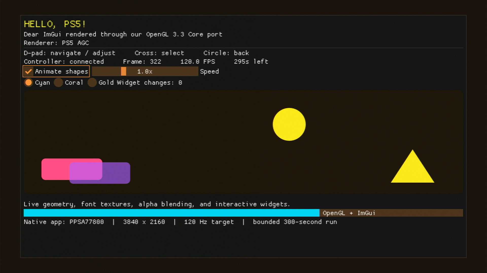

# PS5 OpenGL

**OpenGL 3.3 Core and GLSL 3.30 for PlayStation 5 homebrew.**

An experimental native graphics stack built on Mesa/Gallium, with runtime shader
compilation, fullscreen EGL presentation, a relocatable static SDK, and practical
examples. Application rendering code uses standard OpenGL—not private GPU types.

Demo available by clicking the image below.

[](https://i.imgur.com/jwyvPhT.mp4)

The project completed its defined Core 3.3 validation campaign on a PS5. It is
**not a Khronos-certified implementation**, a stock-console installation method,
or a guarantee that every desktop application will run unchanged.

**Validation baseline: September 7, 2026.** A frozen runtime completed the
four-configuration campaign and installed-SDK renderer checks. Later performance
changes have focused regressions, not a new full CTS campaign; see the
[frozen identity](docs/validation.md#frozen-identity-and-defaults).

**SDK prerelease:** [0.1.0-perf20260907-sampled](https://github.com/blackbearreloaded/ps5-opengl/releases/tag/v0.1.0-perf20260907-sampled)
contains the frozen 1080p60 performance SDK, source examples/dependencies, licenses
and checksums. This candidate passed **204/204 sampled executions**, not a new
full CTS campaign. See the [bundle guide](docs/sdk-bundle.md) for its exact scope.

**Current-source SDK builds:** [GitHub Actions](.github/workflows/release.yml)
produces compiled SDK archives with sources, notices, checksums and provenance.
These fresh binaries are **host-checked, not console-validated**; see
[downloads and release procedure](docs/ci-releases.md). The older prerelease above
is not rebuilt or replaced.

**Earlier high-refresh benchmark (September 7):** the opt-in windowed ImGui
benchmark averages **119.88 FPS at 1080p, 1440p and 4K**, measured for 30 seconds
per size. See the
[results and limits](docs/performance.md#g5d-verified-high-resolution-120-fps-candidate)
and [benchmark build instructions](examples/core33-imgui/README.md#high-refresh-window-benchmark-opt-in).
These are render sizes, not verified HDMI modes. This is small-scene throughput,
not a guarantee of game FPS or perfect frame pacing.

**Latest local candidate (September 8, not published):** G19 fixes nonzero-mip
copies and color-blit channel mappings. **24 mip cycles plus 18 format checks**
pass in one native batch, with balanced tracked GPU memory over two EGL sessions.
The same frozen SDK now also passes **204/204 sampled executions**, a ten-minute
zero-growth tracked-memory soak, and three launch/exit cycles (nine EGL sessions).
Matched 1080p profiles reach **59.95 FPS offscreen** and **59.94 FPS in both
128-cube modes**. The [local SDK bundles](docs/sdk-bundle-g19.md) keep this
evidence separate from the historical full campaign and older downloads.

**Earlier local G13 measurements:** the matched 1080p single-mip 2D RGBA8 offscreen
workload improved from 19.98 to **59.95 FPS** (p95 17.20 ms). A ten-minute soak and
**204/204 focused conformance executions** passed without steady tracked memory
growth. Those original receipts apply to G13; G19 has its own checks above;
see [offscreen and stability findings](docs/offscreen-stability.md). Manual
4K-app startup/input acceptance remains separate; exhaustive stability is not claimed.

## Project Foundation

> [!IMPORTANT]
> **GPU research is documented in [PS5 GPU Research](https://github.com/blackbearreloaded/ps5-gpu-research).**
> The companion repository records the shader toolchain, GPU-visible memory,
> command submission, synchronization, and presentation findings that informed
> this OpenGL implementation, alongside related general-purpose GPU compute
> research. Repository access may be required.

## What is included

- **OpenGL 3.3 Core / GLSL 3.30:** Mesa state tracking, GLSL/NIR compilation,
  the PS5 Gallium driver, and the native GPU/presentation backend.
- **Native EGL:** fullscreen surfaces and the tested context/resource lifecycle.
- **Developer SDK:** headers, static archives, import stubs, and Make,
  pkg-config and CMake integration. Build locally or download a scoped SDK archive.
- **Examples:** a triangle, Dear ImGui, NanoVG, Sokol and a 3D cube benchmark using public APIs.
- **Validation:** 39,544 individual results, exclusion reviews, provenance
  hashes, and an offline evidence verifier.
- **Pinned sources:** upstream revisions and complete local compiler/platform
  patches; no dependency on unpublished research commits.

## Examples

| Example | Demonstrates | Validation |
| --- | --- | --- |
| [Triangle](examples/core33-triangle/README.md) | Minimal public EGL/OpenGL consumer | Installed SDK compile/link checks |
| [Dear ImGui](examples/core33-imgui/README.md) | Widgets, textures, fonts and blending | Six-frame hardware oracle |
| [ImGui TV demo](examples/core33-imgui/README.md#g10-visible-tv-demo) | Readable 1080p UI, animated shapes, gamepad navigation | 5,997 frames over five minutes; 11 readbacks; prior TV confirmation |
| [NanoVG](examples/core33-nanovg/README.md) | Its upstream GL3 vector renderer | 45 pixel probes; zero dirty stencil pixels |
| [Sokol](examples/core33-sokol/README.md) | Its GL backend through public OpenGL | 1,843,200 component comparisons; zero mismatches |
| [Upstream Sokol cube](examples/core33-sokol-cube/README.md) | Adapted existing 3D sample: rotation, depth and culling | 180 native frames / 2,596 probes; full-image heap readback ([scope](examples/core33-sokol-cube/README.md)) |
| [3D cubes benchmark](examples/core33-cubes/README.md) | Lit textured cubes, depth testing, ordinary versus instanced draws | Later 128-cube candidate: 59.94 FPS for both ordinary and instanced draws at 1080p; not a game benchmark ([scope](docs/performance.md#g7-256-entry-batches)) |

The frozen validation-baseline TV demo measured approximately **20 FPS** for
five minutes. Its 30 FPS setting is a pacing ceiling, not achieved performance;
the later 120 FPS measurements above use a separately built performance candidate.
An earlier version was owner-confirmed on a TV; the baseline campaign used
numerical readbacks and lifecycle records. Fresh hardware widget interaction
was not recorded. Host navigation
tests pass. These small examples do not predict full-game FPS.

## Validation status

The frozen campaign covers **9,886 cases across four configurations**:

| Result | Per configuration | Total |
| --- | ---: | ---: |
| Pass | 9,351 | **37,404** |
| Individually reviewed `NotSupported` | 535 | **2,140** |
| Accounted | **9,886** | **39,544** |

No gaps, duplicates, required-case failures, warnings, waivers, or incomplete
results remain in the accepted set. Optional/inapplicable exclusions are reviewed
individually: **39,544 accounted results does not mean 39,544 passes**. Full upstream
swizzle and LOD-bias workloads ran in every configuration. The campaign includes
15 uneventful CTS lifecycle cycles and three final external-renderer hardware checks.

See the [validation report](docs/validation.md) for adaptations, exceptions and
limits, and the [machine-readable evidence](validation/2026-09-07/README.md).

```sh
make test
```

This runs host checks and verifies the published export. **It does not rerun the
PS5 campaign.** CI has no console access.

## Build your first native app

Use Linux/WSL and the pinned native-app boilerplate. Follow
[Building](docs/building.md) for prerequisites and the initial checkout.

```sh
make source-fetch
make sdk
make imgui-demo
```

Upload the generated **folder** `build/native-app/PPSA99005/dist/PPSA99005` to
`/data/homebrew/PPSA99005` in an already configured native homebrew environment,
then launch its registered title. Do not send the application executable to an
ELF loader. Each TV-demo launch runs for five minutes.

Existing projects still need PS5 entry-point, build, window/input and lifecycle
integration. The SDK does not replace GLX, WGL, SDL or GLFW platform code.

## Documentation

| Document | Purpose |
| --- | --- |
| [Building](docs/building.md) | Dependencies, source setup, SDK and native apps |
| [Using the SDK](docs/consumer-build.md) | Make, pkg-config and CMake integration |
| [Sample-validated SDK bundle](docs/sdk-bundle.md) | Frozen 1080p60 package contents, verification and scope |
| [Local G19 SDK bundles](docs/sdk-bundle-g19.md) | Copy fixes, focused sample, performance and bounded stability; not published |
| [CI-built SDK archives](docs/ci-releases.md) | Current-source builds, checksums and draft-release workflow |
| [Architecture](docs/architecture.md) | Frontend, shader compiler, driver and platform boundaries |
| [Testing](docs/testing.md) | Host checks, bounded hardware cases and acceptance |
| [Validation report](docs/validation.md) | Exact results, identity and exceptions |
| [Limitations](docs/limitations.md) | Compatibility, performance and hardware scope |
| [Performance](docs/performance.md) | Measured bottlenecks, GPU acceleration candidates and validation boundaries |
| [Offscreen and stability](docs/offscreen-stability.md) | G13 native storage, bounded G15/G16 memory checks and historical G9/G10 results |
| [Contributing](CONTRIBUTING.md) | Changes, regression selection and reporting |
| [Third-party notices](THIRD_PARTY_NOTICES.md) | Upstream projects, licenses and source pins |

## Project references

| Project | Role |
| --- | --- |
| [Mesa](https://www.mesa3d.org/) | OpenGL, Gallium, GLSL/NIR, ACO/RADV and AMD layout infrastructure |
| [OpenGNM PSBC](https://github.com/PS4-OpenGNM/opengnm-psbc) / [OpenGNM](https://github.com/PS4-OpenGNM/opengnm) | Shader compiler foundation and reference declarations |
| [PS5 Payload SDK](https://github.com/ps5-payload-dev/sdk) | Public homebrew build toolchain and import declarations |
| [Native app boilerplate](https://github.com/blackbearreloaded/ps5-native-app-boilerplate) | Native app assembly, runtime and folder packaging |
| [Khronos VK-GL-CTS](https://github.com/KhronosGroup/VK-GL-CTS) | Pinned OpenGL inventory and runner |
| [Dear ImGui](https://github.com/ocornut/imgui), [NanoVG](https://github.com/memononen/nanovg), [Sokol](https://github.com/floooh/sokol) | Existing renderer integrations |
| [PS5 GPU research](https://github.com/blackbearreloaded/ps5-gpu-research) | Companion research notes; access may be required |
| [Hardware video decoding research](https://github.com/blackbearreloaded/ps5-hardware-video-decoding-research) | Related presentation/lifecycle work; not OpenGL validation |

## Maintainer

PS5 OpenGL is maintained by [BlackBearReloaded](https://github.com/blackbearreloaded).
Project-specific implementation, platform integration, examples and validation
work are credited in the source headers. Upstream projects retain their own
authorship and licenses; see [Third-party notices](THIRD_PARTY_NOTICES.md).

## License

Project-owned code is provided under [GPL-3.0-or-later](LICENSE). Upstream components and
derived patches retain their copyright and licenses; see
[THIRD_PARTY_NOTICES.md](THIRD_PARTY_NOTICES.md) and [LICENSES](LICENSES).

No vendor SDK, firmware modules, device keys, proprietary shader packages,
console-enablement payloads, or raw device logs are distributed here. This
independent project is not affiliated with Sony or The Khronos Group.
